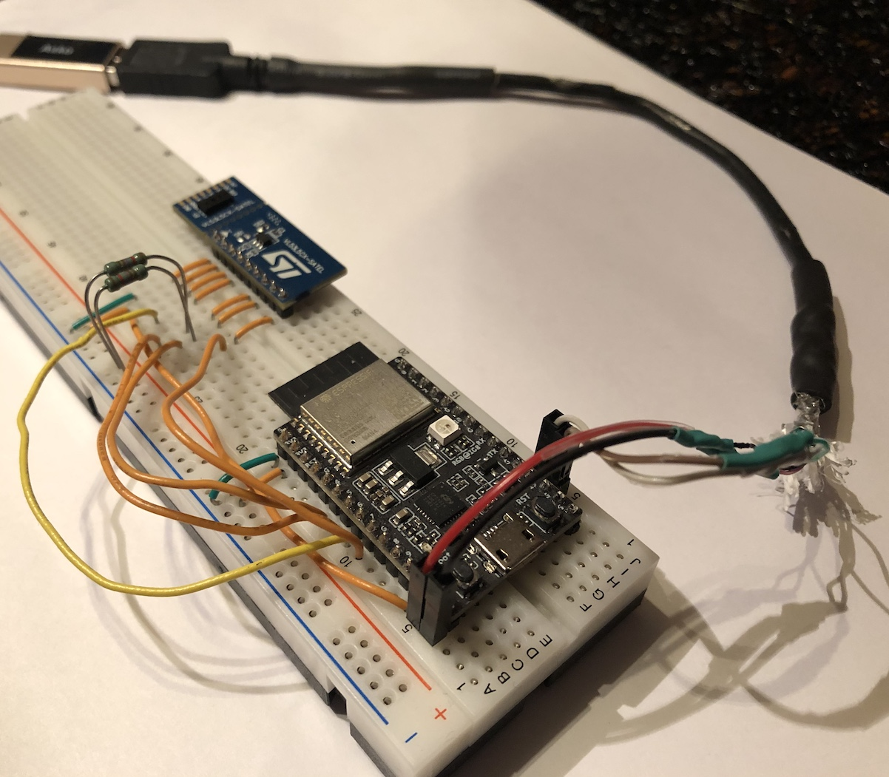

# B

Code base that causes `esp-hal` to hit an assert.

Companion of [A](https://github.com/lure23/A) - which doesn't.


## Requirements

- Rust & Cargo
- GNU `make`
- One of these dev kits

	|||
	|---|---|
	|`esp32c3`|[ESP32-C3-DevKitC-02](https://docs.espressif.com/projects/esp-idf/en/stable/esp32c3/hw-reference/esp32c3/user-guide-devkitc-02.html)|
	|`esp32c6`|[ESP32-C6-DevKitM-01](https://docs.espressif.com/projects/esp-dev-kits/en/latest/esp32c6/esp32-c6-devkitm-1/user_guide.html)|

- Flasher: `espflash` or `probe-rs`

	- [`espflash`](https://github.com/esp-rs/espflash) from Espressif
	- ..and/or [`probe-rs`](https://github.com/probe-rs/probe-rs) which is multi-target (ARM, RISC-V)

	<details><summary>`probe-rs`</summary>

	```
	$ probe-rs list
	The following debug probes were found:
	[0]: ESP JTAG -- 303a:1001:54:32:04:07:15:10 (EspJtag)
	```
	</details>

	<details><summary>`espflash`</summary>

	```
	$ espflash board-info
	[2025-03-11T16:22:04Z INFO ] Serial port: '/dev/ttyUSB0'
	[2025-03-11T16:22:04Z INFO ] Connecting...
	[2025-03-11T16:22:04Z INFO ] Using flash stub
	Chip type:         esp32c6 (revision v0.0)
	Crystal frequency: 40 MHz
	Flash size:        4MB
	Features:          WiFi 6, BT 5
	MAC address:       54:32:04:07:15:10
	```
	</details>
	
- SATEL board

	One [SATEL board](https://www.st.com/en/evaluation-tools/vl53l5cx-satel.html) is needed. 

	For wiring, see [`pins.toml`](./pins.toml).




## Build & run

### Selecting the MCU

The GitHub code base defaults to ESP32-C3. To use ESP32-C6, edit the following, by hand:

- `.cargo/config.toml`: change the `target` line:

	```
	target = "riscv32imac-unknown-none-elf"  # C6
	```

- `Cargo.toml`: change all `"esp32c3"` -> `"esp32c6"`


### Make it

- Attach the devkit

	>Note: You can attach the USB to either USB/UART or USB/JTAG.

- Have SATEL wired

```
$ make -f Makefile.dev m3-slim
EXAMPLE=m3 \
  FEATURES=,run_with_espflash,distance_mm \
  make -f Makefile.dev --no-print-directory _build _run-with-espflash
DEFMT_LOG=esp_hal=info,debug cargo build --release --features=,run_with_espflash,distance_mm --example m3
[...]
DEBUG Ping succeeded: 0xf0,0x02
INFO Init succeeded
ERROR panicked at 'assertion failed: prev != 0'
ERROR ====================== PANIC ======================
ERROR panicked at /home/ubuntu/.cargo/registry/src/index.crates.io-1949cf8c6b5b557f/defmt-0.3.10/src/lib.rs:380:5
ERROR Backtrace:
ERROR 0x42007d46
0x42007d46 - defmt::default_panic::panic_cold_explicit
    at /rustc/4eb161250e340c8f48f66e2b929ef4a5bed7c181/library/core/src/panic.rs:88
ERROR 0x42007d08
0x42007d08 - __defmt_default_panic
    at /home/ubuntu/.cargo/registry/src/index.crates.io-1949cf8c6b5b557f/defmt-0.3.10/src/lib.rs:380
ERROR 0x42003698
0x42003698 - defmt::export::panic
    at /home/ubuntu/.cargo/registry/src/index.crates.io-1949cf8c6b5b557f/defmt-0.3.10/src/export/mod.rs:133
ERROR 0x4200344c
0x4200344c - esp_hal::system::PeripheralClockControl::enable_forced::{{closure}}
    at /home/ubuntu/.cargo/registry/src/index.crates.io-1949cf8c6b5b557f/esp-hal-1.0.0-beta.0/src/system.rs:1111
ERROR 0x42000f06
0x42000f06 - esp_hal::i2c::master::I2c<Dm>::internal_recover
    at /home/ubuntu/.cargo/registry/src/index.crates.io-1949cf8c6b5b557f/esp-hal-1.0.0-beta.0/src/i2c/master/mod.rs:482
```

This `assert` should not be stepped to. 

The point of this repo is to find out, why it happens.

### Make it (C6)

Do the changes mentioned above.

Check that your wiring matches what's for ESP32-C6 in `pins.toml`. 

```
$ DEFMT_LOG=trace make -f Makefile.dev m3-slim
EXAMPLE=m3 \
  FEATURES=,run_with_espflash,distance_mm \
  make -f Makefile.dev --no-print-directory _build _run-with-espflash
DEFMT_LOG=esp_hal=info,debug cargo build --release --features=,run_with_espflash,distance_mm --example m3
[...]
TRACE I2C read: 0x2c00 -> [0x05, 0x03, 0x00, 0x00]
INFO Init succeeded
TRACE Writing: 0x7fff <- [0x00]
```

It gets stuck there.

**Presumption** is that once the reason for the `assert` problem gets resolved on ESP32-C3, things should work the whole way also for ESP32-C6. Remains to be seen..


## References

### VL53L5CX

- [Breakout Boards for VL53L5CX](https://www.st.com/en/evaluation-tools/vl53l5cx-satel.html) (ST.com)
- [Ultra Lite Driver (ULD) for VL53L5CX multi-zone sensor](https://www.st.com/en/embedded-software/stsw-img023.html) (ST.com)

	- ["Ultra lite driver (ULD) [...] with wide field of view"](https://www.st.com/resource/en/data_brief/stsw-img023.pdf) (PDF, May'21; 3pp)
	- ["A guide to using the VL53L5CX multizone [...]"](https://www.st.com/resource/en/user_manual/um2884-a-guide-to-using-the-vl53l5cx-multizone-timeofflight-ranging-sensor-with-a-wide-field-of-view-ultra-lite-driver-uld-stmicroelectronics.pdf) (PDF, revised Feb'24; 18pp)

- [VL53L5CX Product overview](https://www.st.com/resource/en/datasheet/vl53l5cx.pdf) (ST.com DS13754, Rev 12; April 2024)

### SATEL

- [How to setup and run the VL53L5CX-SATEL using an STM32 Nucleo64 board]() (ST.com AN5717, Rev 2; Dec 2021)
- [PCB4109A, version 12, variant 00B](https://www.st.com/resource/en/schematic_pack/pcb4109a-00b-sch012.pdf) (ST.com; 2021; PDF 2pp.)

	>*Interestingly, marked `CONFIDENTIAL` but behind a public web link.*
